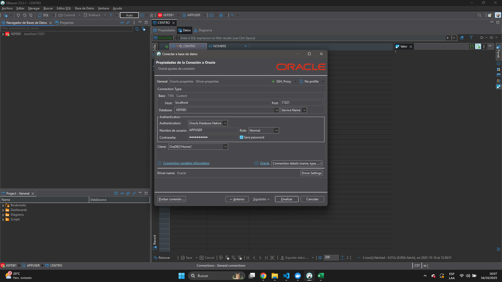
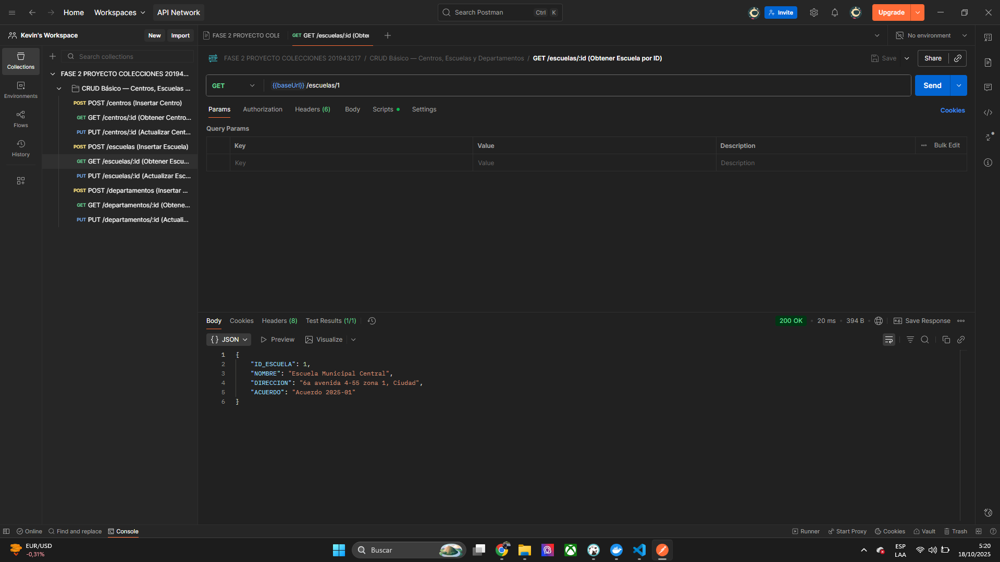
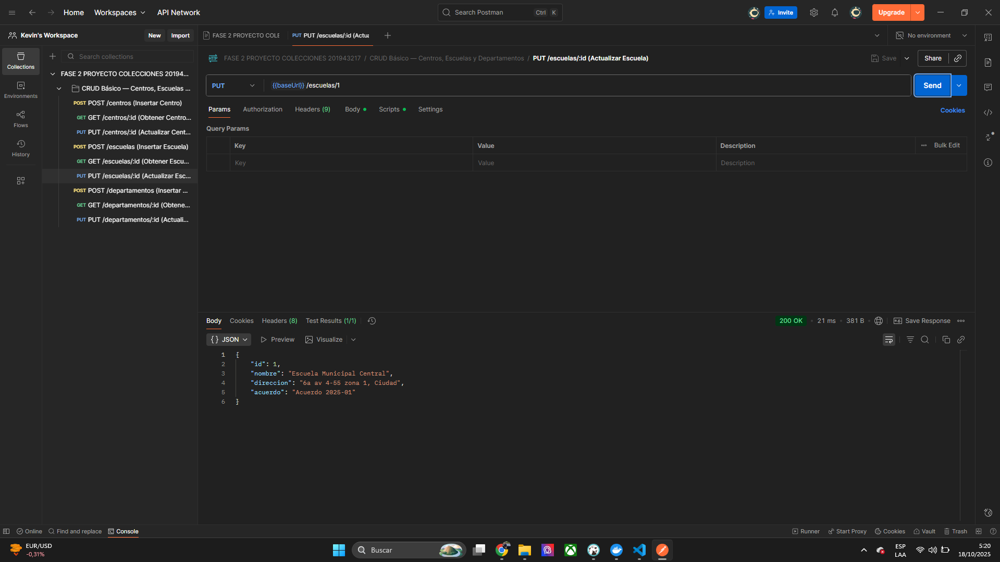
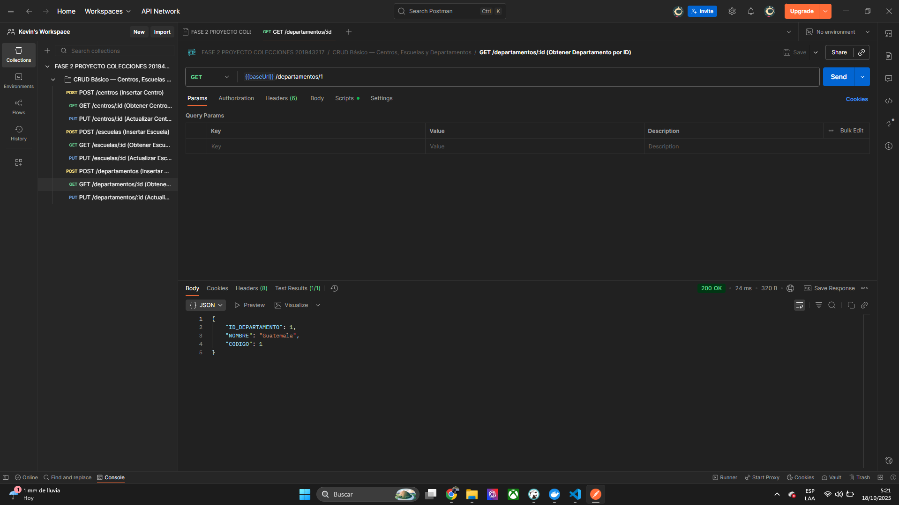

# Proyecto Fase 2 – Base de Datos 1 
**Universidad de San Carlos de Guatemala – Escuela de Ciencias y Sistemas** 
**Curso:** Base de Datos 1 – Segundo Semestre 2025 
**Estudiante:** Kevin Jiménez 
**Carne:** 201943217 
**Sección:** B 

--- Descripción del Proyecto Este proyecto desarrolla una plataforma de gestión de exámenes teóricos y prácticos para los centros de evaluación de licencias de conducir. Su objetivo principal es simular un sistema completo que permita administrar: 

- Centros y Escuelas (Catálogos base) 
- Departamentos y Municipios 
- Registros de solicitantes, correlativos y exámenes 
- Preguntas teóricas y prácticas 
- Respuestas de usuarios y generación de reportes 

El sistema se ejecuta completamente con contenedores Docker, integrando: Oracle Database XE (21c) | Base de datos principal con secuencias. 

API REST (Node.js + Express) | Proporciona los endpoints CRUD para todas las entidades. Postman | Colección de pruebas para validación de cada módulo. Pasos de Despliegue ### Requisitos - Docker y Docker Compose instalados - Node.js 20 

- DBeaver (para conexión a Oracle y ejecución de scripts SQL) 

--- ### Desplegar Oracle Database (Docker) Desplegar Oracle Database (Docker) Esto levantará el contenedor oracle-xe con el esquema APPUSER y cargará los scripts: 00_create_appuser.sql 01_schema.sql Verificamos que esté corriendo: 

### Desplegar la API REST 

Una vez la base esté lista: docker compose up -d api Podemos comprobar su funcionamiento accediendo a: http://localhost:3000/health Esto deberia responder de la siguiente manera: { "status": "ok", "db": true } 

### Guía de Conexión con DBeaver 

abre DBeaver y crea una nueva conexión → elige Oracle Completa los datos: Campo Valor Host localhost Port 11521 Database (SID/Service) XEPDB1 Username APPUSER Password AppUser123 

### Conexión desde DBeaver 

 

Probamos la conexion y luego finalizar. 

### Evidencias (Capturas) 

--- Obtener Centro  

--- Actualizar Centro  
--- Obtener Escuela  
--- Actualizar Escuela  --Obtener Departamento  ### USO DE ENDPOINT En este sistema, los endpoints fueron implementados en Node.js (Express) con conexión a Oracle 

Database utilizando el paquete oracledb. Cada ruta permite ejecutar operaciones CRUD sobre las tablas principales del proyecto (Centros, Escuelas y Departamentos) entreo otros. 

--- Implementación en Node.js El backend utiliza un pool de conexiones Oracle, consultas con bind variables (seguras contra inyección SQL) y el patrón REST con Express. --- Pruebas desde Postman La colección incluye los endpoints de Centros, Escuelas y Departamentos, documentados con ejemplos y validaciones automáticas.
